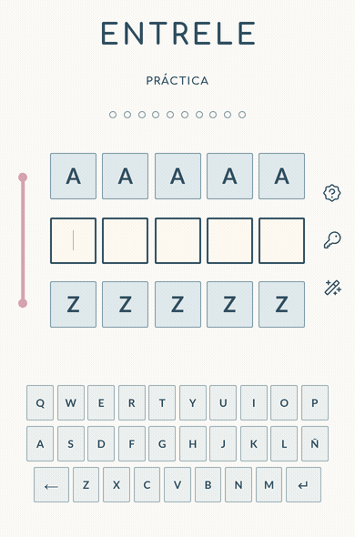

  

  <strong>Un juego diario de palabras en español, hecho especialmente para María Triple M.</strong>

  <a href="https://entrele.vercel.app"><strong>Jugar en modo práctica &#10132;</strong></a>

## Por qué existe

ENTRELE nació para [María](https://github.com/mery-merxx), que siempre está
jugando Wordle, Octordle y otros juegos de palabras. Hace un tiempo probé
Betweenle y estaba seguro de que a ella le gustaría la idea, pero está en
inglés. Así que decidí crear uno propio en español, pensado especialmente para
ella.

Así llegó ENTRELE junto a Laborto, la vaca que bautizamos en 2025 y que María
dibujó para el juego.

Es una pequeña forma de agradecerle lo buena que ha sido conmigo. Ojalá siempre
reciba cosas a la altura de la persona que es.

## Jugar

Como María inspiró ENTRELE, lo lógico era que la palabra diaria fuera suya. El
modo práctica está abierto para cualquiera que quiera probar el juego, sin
necesidad de una cuenta.

## Cómo se juega

Hay una palabra escondida de cinco letras y diez intentos válidos para
encontrarla. Cada intento cierra el intervalo por orden alfabético, si la
respuesta está después, la palabra pasa a ser el límite inferior, si está antes,
pasa a ser el límite superior. El indicador se mueve para mostrar qué tan cerca
estuvo el intento.

Las palabras inválidas, repetidas o fuera del intervalo no gastan intentos.

  

## Créditos

- [María](https://github.com/mery-merxx): inspiración de ENTRELE y creadora de Laborto.
- [Claudio](https://github.com/silerx): creador del personaje de papas y asesor artístico
  top tier. Sin él, esa parte del juego no habría sido posible.
- [Edicson - Yo (lavapatos)](https://github.com/lavapatos): diseño y desarrollo.

El diccionario base utiliza <a href="./public/licenses/dictionary-es-cl.txt">dictionary-es-cl</a>.
